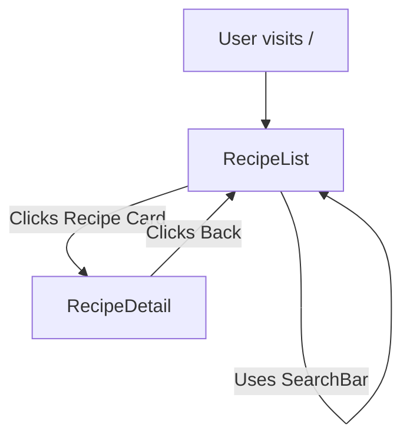

# Recipe App

A simple and modern React recipe application built with Vite. This app allows users to browse, search, and view details for a collection of recipes. It demonstrates best practices with React functional components, hooks, and React Router.

Deployed in Vercel: https://recipe-app-rust-kappa.vercel.app/

## Features

- **Recipe List Page**: Displays all recipes in a responsive grid layout.
- **Recipe Detail Page**: Click a recipe card to view full details, including ingredients and instructions.
- **Search Functionality**: Filter recipes by title, ingredient, or category in real time.
- **Responsive Design**: Works on both mobile and desktop devices.
- **Routing**: Uses React Router for navigation between list and detail views.
- **Mock Data**: Recipes are loaded from a local mock data file.
- **Modern Tooling**: Built with Vite for fast development and hot module replacement.

## Project Structure

```
/ (root)
├── index.html
├── package.json
├── vite.config.js
└── src/
    ├── App.jsx
    ├── App.css
    ├── index.css
    ├── main.jsx
    ├── components/
    │   ├── RecipeList.jsx
    │   ├── RecipeCard.jsx
    │   ├── RecipeDetail.jsx
    │   └── SearchBar.jsx
    └── data/
        └── recipes.js
```

## Main Tools Used

- [React](https://react.dev/) (UI library)
- [Vite](https://vitejs.dev/) (build tool)
- [React Router DOM](https://reactrouter.com/) (routing)

## How to Run

1. Install dependencies:
   ```sh
   npm install
   ```
2. Start the development server:
   ```sh
   npm run dev
   ```
3. Open [http://localhost:5173](http://localhost:5173) in your browser.

## App Flow (Mermaid Diagram)



## Functionality Overview

- **RecipeList**: Shows all recipes as cards. Clicking a card navigates to the detail page.
- **RecipeCard**: Displays a preview of a recipe (image, title, description, category).
- **RecipeDetail**: Shows full recipe info, ingredients, and instructions. Includes a back button.
- **SearchBar**: Filters recipes by title, ingredient, or category as you type.